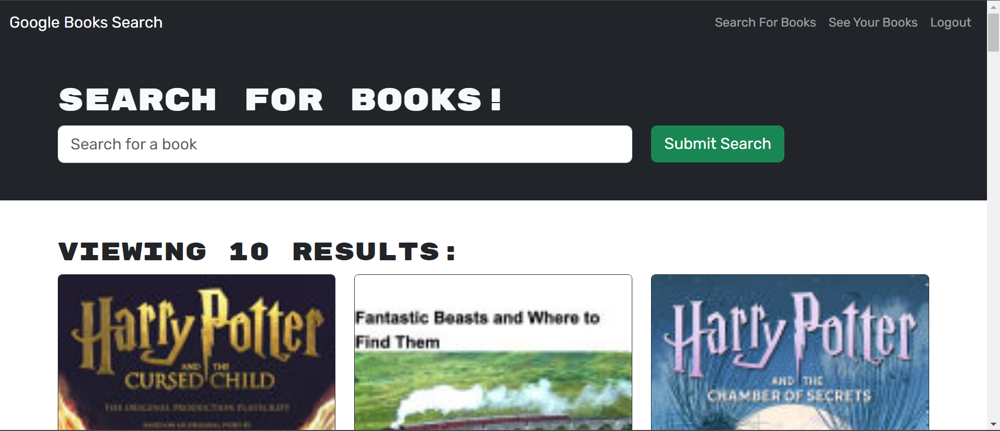
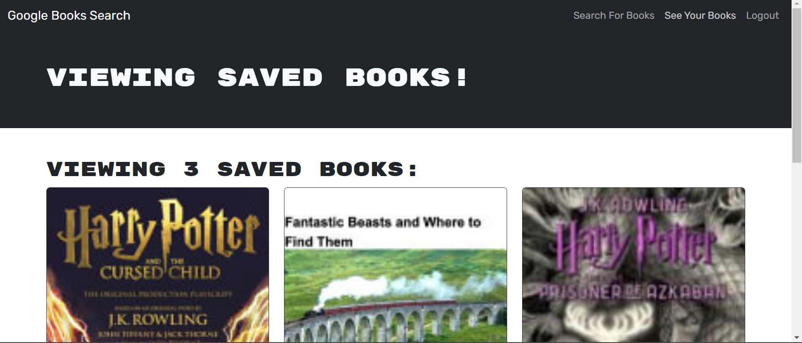

# Book Search Engine

## Description

This application is a full stack application using the MERN stack. Additionally, it employs the use of GraphQL.

## Table of Contents

[Usage](#usage)

[Questions](#questions)

## Usage

Go to the deployed [website](https://book-search-engine-5h89.onrender.com). There you can:

1. Create an account
2. Search for books to add to your saved books list
3. View your saved books list
4. Delete books from your saved books list
5. Logout
6. Login

See below for images of the website:

## Questions

[GitHub](https://github.com/bhansi)

If you have any questions, you can reach me via my [email](mailto:baljotshansi@gmail.com).
